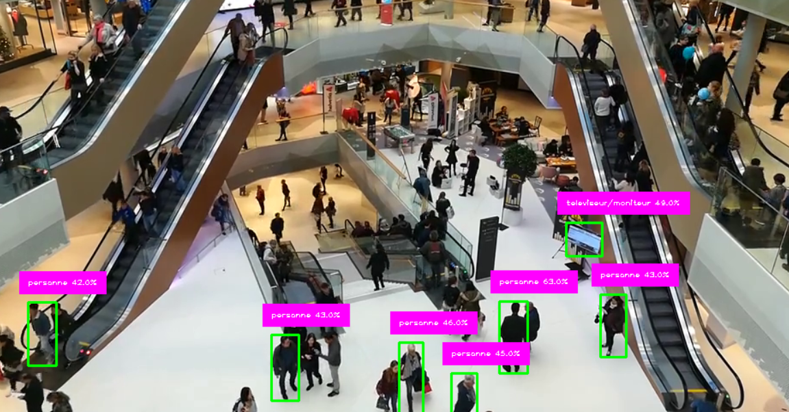
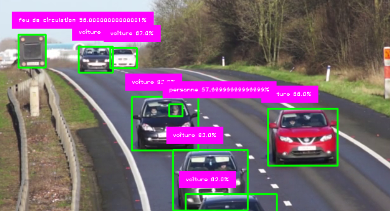

# 🚗👤 Détection de Voitures et de Personnes

## 🌟 Présentation

Ce projet utilise Python et des modèles de vision par ordinateur pour détecter les voitures 
et les personnes dans des images et des vidéos. Il repose sur OpenCV et des modèles de deep learning
pour une détection en temps réel et efficace.

##🔥 Fonctionnalités

✅ Détection en temps réel des voitures et des personnes 🚀
✅ Prise en charge des flux vidéo, des images et de la webcam 🎥
✅ Modèles pré-entraînés pour une haute précision 🎯
✅ Facile à utiliser avec une simple ligne de commande ⚡

